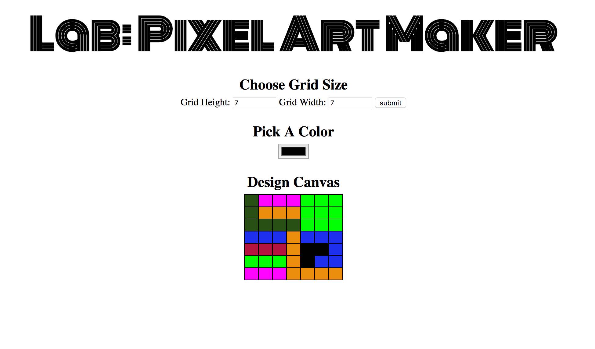

# Pixel Art Maker Project
This project allows you to create [8 bit](https://www.freelancer.com/community/articles/8-bit-art-what-is-it-how-can-you-use-it) Pixel Art.

## Code style
Udacity Javascript [style guide](http://udacity.github.io/frontend-nanodegree-styleguide/javascript.html)

## Screenshot

## Stack used
- Html
- Css
- Vanilla Javascript

## Features
- create a n by m grid
- choose a color
- click a cell in the grid to fill with chosen color

## Issues
* color picker crashes on Firefox Developer edition